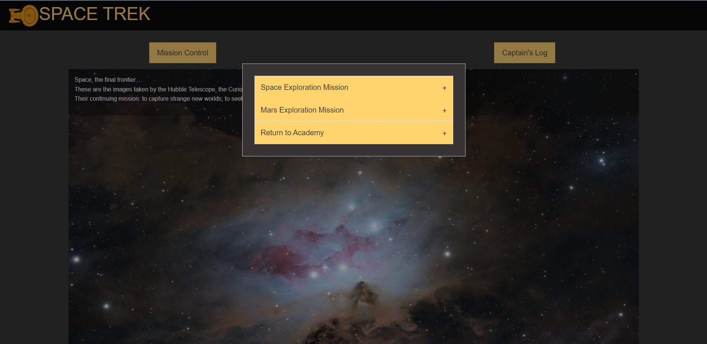
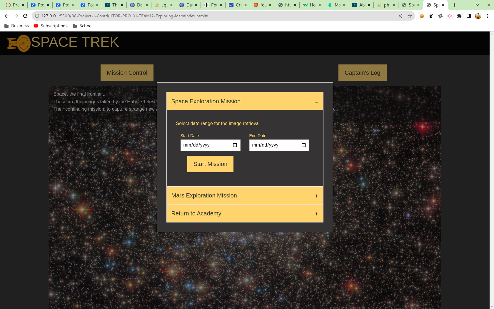
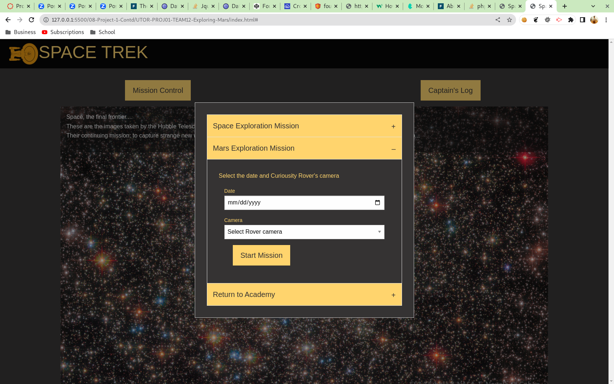
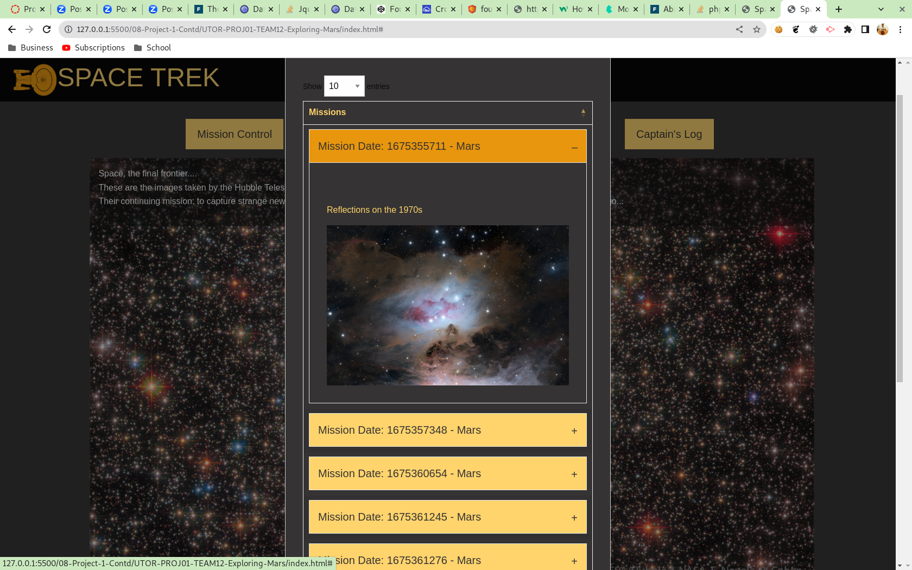

# Space Trek

University of Toronto - Project 01 - Team 12 - Exploring Mars app

## Description

The web page provides an interactive experience for users interested in space and Mars exploration. The main sections, "Mission Control" and "Captain's Log", are designed to provide a comprehensive overview of space and Mars-related content.

The Mission Control section is particularly noteworthy, as it offers two sub-sections:

### Space Exploration Mission

The Space Exploration section allows users to delve deeper into the vast expanse of space by viewing images taken on a selected date range. This feature is perfect for anyone interested in learning more about the cosmos.

### Mars Exploration Mission

The Mars Exploration section, on the other hand, provides a unique look at the Red Planet through the eyes of NASA's Mars Rover. Users can select a date and camera angle to view images captured on the rover's journey. This section is ideal for anyone who wants to see the Martian landscape from different angles.

The images are displayed in an "orbit" - a carousel - so that the user can scroll through them. With this web page, users will have access to a wealth of information and resources about space and Mars.

Below is the image of the application.

Below is the image of the application when the user clicks into Mission Control.

Below is the image of the application when user has selected space exploration

Below is the image of the application when user has selected Mars exploration

Below is the image of Captain's log

## Table of Contents

- Installation
- Functionality
- Usage
- Credits
- License

## Installation

No installation requirements. [Click here](https://scorpionfiko.github.io/UTOR-PROJ01-TEAM12-Space-Trek/) to open the webpage in your default browser.

## Technologies and Functionality

The following discusses at a high level about some of the features of the website. Detailed code implementation can be found as comments in the JS files.

### Foundation CSS [link](https://get.foundation/index.html)

The entire website is based on the Foundation CSS framework. Most notably:

- Orbit: this is the image carousel where the space exploration images are displayed
- Accordion: the mission control selectors and captain's log items are foundation accordion containers
- Reveal: these are the modal boxes that open up when the user clicks on the mission control or the Captain's log
- Abide: this is the form validation plug in from Foundation that ensures form data is correct before proceeding

### DataTable [link](https://datatables.net/)

The captain's log table is a DataTable. That means the table is automatically paginated and displayed based on the number of rows as selected in the drop down box. In turn the table is a listing of accordion containers that have within them the stored images form local storage

### NASA API's

The application is using two NASA API's

- APOD (Astronomy Picture Of the Day): this displays the space images taken by either telescopes or humans. The API has a date parameter that has been used to select images from the "past".
- Mars Rover Photos: displays the Mars rover photos from the Curiosity rover. It must be noted that:
  - the rover does not take images daily
  - when images are taken not all of the Rover's cameras take pictures
  - when images are taken, each camera may take different number of pictures.

Therefore, in some searches no images are returned. For the purposes of demonstration, Jan 27, 2023 is the date where all the cameras have taken images.

### Local Storage:

Local storage is based on a unique mission ID. The mission ID is the unix timestamp of then the user has clicked on the Start Mission button. The other item stored in local store is the images returned from the API call or the stock image in case the API has not returned images.

Local storage is always updated as that represents "new mission."

### Dayjs

Dayjs is used for all day handling and format in the application. The Dayjs unix timestamp method has been used to arrive at the mission dates.

## Usage

### To Access the Application

- [Click here](https://scorpionfiko.github.io/UTOR-PROJ01-TEAM12-Space-Trek/) to visit the application.

#### To Start a Mission

- Click on the mission control button.
- Select from Space Exploration Mission or Mars Exploration Mission.
  - Fill in the required parameters for each type of mission.
- Click on the "Start Mission" button
- You will be shown the images according to the search criteria

#### To View the Captain's Log

- Click on the Captain's log button
- Click on any of the mission displayed in the table
  - if no missions are present, the only buttons are "Return to Captain's Quarters"
- The log will expand showing all the images within it

### For viewing the responsiveness of the website:

#### Method 1:

- Use separate computer, tablet, or phone to access the website

#### Method 2:

- Access the web page via web browser.
- Right click on the page and select "inspect" to open browser's developer tools
- Enable the device toolbar if not already enabled
- Use the device toolbar on the right to grow or shrink the viewable area and see how items change.

## Credits

- Stefan Marinov.
- Devarsh Patel.
- Fabian Mukungu.
- Images taken from NASA via their public API's. U.S.S.
- Enterprise 1701-D image created by Chris from the Noun Project.

## License

MIT License

## Future Considerations

Below are some thoughts for future upgrades:

- Add ability to get images from Opportunity and Spirit Mars rovers
- Add ability to look up rover manifest to determine photo dates and number of photos
- Add ability to search by other criteria E.g. Mars sol date
- Display the full Mars Rover images (currently limited to 25)
- Auto shrink the captain’s log entries when a different mission is reviewed
- Ability to load the captain’s log images into a mini carousel
